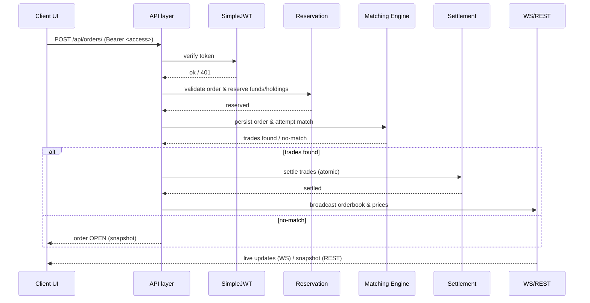

# 🔧 Mini Exchange — Backend

Concise, visual overview of the backend architecture, request flow, and core components.

---

## One-line summary

- A real-time trading backend using Django + DRF + Channels. It supports JWT auth, order reservation, price-time matching, atomic settlement, and WebSocket broadcasts for live orderbook and prices.

---

## Visual flow — order placement (sequence)



> Tip: View this file on GitHub/GitLab or a Markdown preview that supports Mermaid to see the diagram rendered.

---

## Core components (quick reference)

- 🔁 Matching engine — `exchange/services/matching_engine.py`
  - Price-time priority matching; returns executed trades for settlement.
- 💳 Exchange service (reservation & validation) — `exchange/services/exchange_service.py`
  - Validates orders (±10% price band), reserves funds/holdings, persists orders.
- ⚖️ Settlement — `exchange/services/settlement.py`
  - Applies executed trades atomically to portfolios/holdings and updates `Symbol.last_price`.
- 🌐 Broadcasting / WebSockets — `exchange/consumers.py` / `exchange/services/*`
  - `broadcast_orderbook(symbol)` and `broadcast_prices()` push updates to `/ws/orderbook/` and `/ws/prices/`.
- 🤖 Market simulator — `exchange/services/market_simulator.py`
  - Background market-maker simulation to provide liquidity and price movement for testing/demo.
- 🧾 Candles / Charting endpoint — `exchange/services/price_fetch.py` + `/api/candles/`
  - Provides OHLC data (Twelve Data or local aggregation) consumed by the frontend charts.

---

## Data model snapshot

- `Symbol` — `name`, `last_price`, `last_price_updated_at`
- `Order` — `user`, `symbol`, `side`, `price`, `quantity`, `filled_quantity`, `status`
- `Trade` — `buy_order`, `sell_order`, `price`, `quantity`, `executed_at`
- `Portfolio` — `user`, `available_balance`, `reserved_balance`
- `Holding` — `user`, `symbol`, `available_quantity`, `reserved_quantity`

---

## Important behaviours (short)

- Reservation: BUY reserves portfolio funds; SELL reserves holdings to prevent oversell.
- Matching: Price-time priority (BUY: highest price first; SELL: lowest price first; FIFO within price).
- Price validation: orders must be within ±10% of `Symbol.last_price` to protect market sanity.
- Settlement: atomic updates using `@transaction.atomic` and `select_for_update()`.
- Real-time: orderbook and prices are broadcast to WebSocket groups so clients receive live updates.

---

## Run locally — minimal steps

```bash
cd backend
python -m venv .venv
.venv\Scripts\activate            # Windows
pip install -r requirements.txt
python manage.py migrate
python manage.py createsuperuser
python manage.py runserver 0.0.0.0:8000
```

Configuration hints

- `DATABASE_URL` — set a Postgres DSN for production; otherwise SQLite `db.sqlite3` is used locally.
- `SECRET_KEY`, `DEBUG`, and `TWELVE_DATA_API_KEY` (optional) are respected by `config/settings.py`.

---

## Debugging & tips

- Inspect network requests in browser DevTools to verify `Authorization: Bearer <access>` header on API calls.
- Check Channels consumer logs to confirm WebSocket groups and messages (`/ws/orderbook/`, `/ws/prices/`).
- If orders rejected due to price band, the API will return a helpful message containing market price and valid range.
- For connection-exhaustion issues in production, use PgBouncer or adjust connection pooling/timeouts in `config/settings.py`.

---

If you'd like, I can:

- generate an SVG/PNG of the Mermaid diagram and add it to the repo,
- add example `curl` commands for common endpoints (login, place order, cancel), or
- add a one-page architecture PNG showing process boundaries (API, DB, background worker, WebSocket hub).

Tell me which and I'll add it.

---

## Quick API examples (curl)

Replace `API_BASE` with your backend origin (e.g. `http://127.0.0.1:8000/api`).

Register:

```bash
curl -X POST "${API_BASE}/register/" \
  -H "Content-Type: application/json" \
  -d '{"username":"alice","password":"s3cur3P@ss"}'
```

Login (get tokens):

```bash
curl -X POST "${API_BASE}/token/" \
  -H "Content-Type: application/json" \
  -d '{"username":"alice","password":"s3cur3P@ss"}'
```

Place an order (requires `access` token):

```bash
curl -X POST "${API_BASE}/orders/" \
  -H "Content-Type: application/json" \
  -H "Authorization: Bearer <ACCESS_TOKEN>" \
  -d '{"symbol":"AAPL","side":"BUY","price":"130.00","quantity":1}'
```

Cancel an order:

```bash
curl -X POST "${API_BASE}/orders/<ORDER_ID>/cancel/" \
  -H "Authorization: Bearer <ACCESS_TOKEN>"
```

Get orderbook snapshot (polling fallback):

```bash
curl "${API_BASE}/orderbook/?symbol=AAPL"
```

Refresh access token (if using refresh flow):

```bash
curl -X POST "${API_BASE}/token/refresh/" \
  -H "Content-Type: application/json" \
  -d '{"refresh":"<REFRESH_TOKEN>"}'
```

---

## Environment & migration checklist

- Ensure required env vars are set before starting in production:
  - `DATABASE_URL` (Postgres DSN)
  - `SECRET_KEY`
  - `DEBUG` (False in prod)
  - `TWELVE_DATA_API_KEY` (optional for candles)
  - Install `yfinance` if live price fetching is enabled: `pip install yfinance`
- Run migrations and create admin user:

```bash
python manage.py migrate
python manage.py createsuperuser
```

- If `0004_seed_market_maker` or similar migrations were previously applied empty, you may need to seed the `market_maker` user manually via the Django admin or a small management command. Check `exchange/migrations/0004_seed_market_maker.py`.

---
