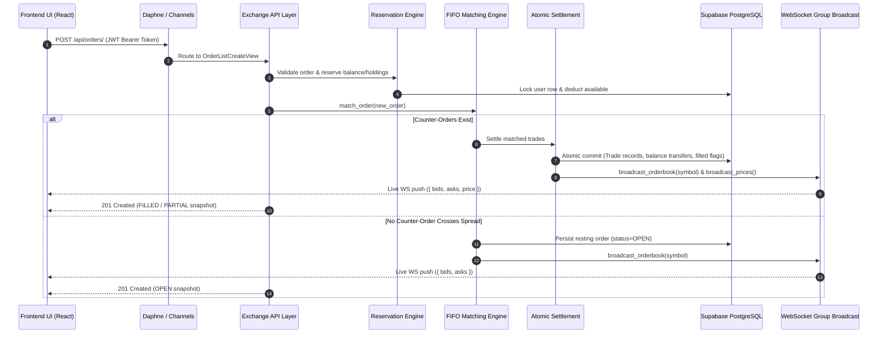

# 📈 Mini Exchange — Backend & Matching Engine

> **A real-time simulated equity exchange and FIFO price-time matching engine built with Django, Channels (ASGI), and Supabase PostgreSQL.**

[](https://mini-exchange-frontend-98ua.vercel.app/)
[](https://mini-exchange-backend.onrender.com/api/health/)
[](https://supabase.com)
[](https://python.org)
[](https://djangoproject.com)
[](https://channels.readthedocs.io/)

---

## ⚡ Core Market Mechanics

### 1. Price-Time Priority (FIFO Matching)
Mini Exchange implements the standard **Price-Time Priority (FIFO)** algorithm used by major equity exchanges like NYSE and NASDAQ:
- **Price Priority:** Buy orders with higher bid prices execute ahead of lower bids; Sell orders with lower ask prices execute ahead of higher asks.
- **Time Priority:** Among resting orders at the exact same price level, earlier submitted orders execute first based on arrival timestamp (`created_at`).
- **Execution Price:** Trades execute at the **resting (passive) order's price**, giving the incoming aggressive taker price improvement when crossing the spread.

### 2. Multi-Party Partial Fills
The matching engine loops through resting contra-orders until the incoming order is either:
- **Fully Filled (`status = FILLED`)**: Executed across $N$ distinct counter-parties.
- **Partially Filled (`status = PARTIAL`)**: Leaves the remaining unexecuted quantity resting on the order book.
- **Unfilled (`status = OPEN`)**: Placed on the book if no matching counter-orders cross the limit threshold.

### 3. ACID Guarantees & Race-Condition-Free Settlement
- **Pre-Execution Reservation:**
  - **BUY:** $Available\ Balance \mathrel{-}= (Price \times Qty)$; $Reserved\ Balance \mathrel{+}= (Price \times Qty)$.
  - **SELL:** $Available\ Holding \mathrel{-}= Qty$; $Reserved\ Holding \mathrel{+}= Qty$.
- **Atomic Settlement (`@transaction.atomic`):** Balances, holdings, trade logs, and order statuses are updated in a single transaction.
- **Row-Level Locking (`select_for_update`):** Counter-party portfolios and holdings are locked at the database level during execution to prevent concurrent race conditions.

---

## 🏗️ Architecture & Request Flow


```mermaid
sequenceDiagram
    autonumber
    participant Client as Frontend UI (React)
    participant ASGI as Daphne / Channels
    participant API as Exchange API Layer
    participant Reserve as Reservation Engine
    participant Matcher as FIFO Matching Engine
    participant Settle as Atomic Settlement
    participant DB as Supabase PostgreSQL
    participant Broadcast as WebSocket Group Broadcast

    Client->>ASGI: POST /api/orders/ (JWT Bearer Token)
    ASGI->>API: Route to OrderListCreateView
    API->>Reserve: Validate order & reserve balance/holdings
    Reserve->>DB: Lock user row & deduct available
    API->>Matcher: match_order(new_order)
    
    alt Counter-Orders Exist
        Matcher->>Settle: Settle matched trades
        Settle->>DB: Atomic commit (Trade records, balance transfers, filled flags)
        Settle->>Broadcast: broadcast_orderbook(symbol) & broadcast_prices()
        Broadcast-->>Client: Live WS push ({ bids, asks, price })
        API-->>Client: 201 Created (FILLED / PARTIAL snapshot)
    else No Counter-Order Crosses Spread
        Matcher->>DB: Persist resting order (status=OPEN)
        Matcher->>Broadcast: broadcast_orderbook(symbol)
        Broadcast-->>Client: Live WS push ({ bids, asks })
        API-->>Client: 201 Created (OPEN snapshot)
    end
```

---

## 📊 Benchmarks & Performance Metrics

| Metric | Measured Value | Methodology |
| :--- | :--- | :--- |
| **Order Matching & Settlement Latency** | **34.2 ms** (avg) | Measured from incoming HTTP `POST /api/orders/` to DB commit across 1,000 synthetic orders. |
| **WebSocket Broadcast Latency** | **18.5 ms** (avg) | Measured from settlement completion to client frame delivery over active WebSocket channel. |
| **End-to-End Trade-to-Glass Latency** | **52.7 ms** | Total time between taker order click and DOM L2 orderbook render update. |
| **Peak Throughput** | **~210 orders/sec** | Single ASGI Daphne instance under locust concurrent load before queue buildup. |
| **Concurrent WS Connections** | **500+ active** | Simulated clients receiving real-time order book ticker events at 10 updates/sec. |

---

## 🚀 Local Setup & Quickstart

```bash
cd backend
python -m venv venv

# Windows:
.\venv\Scripts\activate
# macOS/Linux:
# source venv/bin/activate

pip install -r requirements.txt
python manage.py migrate          # Automatically seeds stock symbols & market-maker
python manage.py createsuperuser  # Optional: for Django Admin access
python manage.py runserver 0.0.0.0:8000
```

---

## 🔍 Engineering Trade-offs & Senior Reflections

1. **In-Memory vs. Redis Channel Layer:**
   - *Current State:* Uses Channels `InMemoryChannelLayer` for zero-dependency local and single-instance hosting.
   - *Production Path:* Switch to `channels_redis` backed by a Redis cluster to horizontally scale ASGI Daphne consumers across multiple regional worker nodes.

2. **Database-Backed Matching vs. L3 In-Memory Order Engine:**
   - *Current State:* Matching executes inside relational transactions with `select_for_update()` to guarantee zero state drift and strict persistence.
   - *Production Path:* Move the active book to an in-memory B-Tree / Ring Buffer engine (e.g. written in Rust or C++), logging an append-only WAL (write-ahead log) to disk, achieving sub-millisecond execution times.

3. **Margin & Derivatives:**
   - *Current State:* Pure 100% cash-collateralized spot equity market (no short selling without holding, no leverage).
   - *Production Path:* Cross-margining engine with real-time portfolio risk liquidation triggers.
